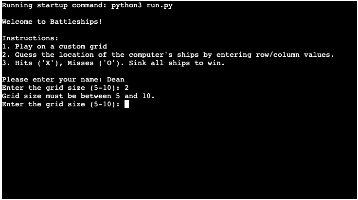
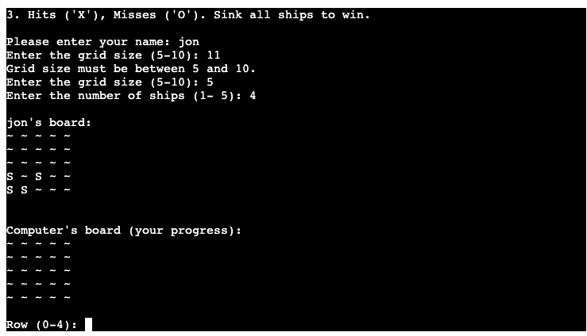
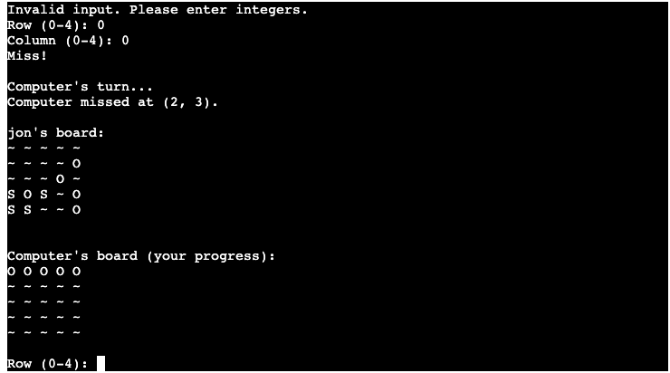
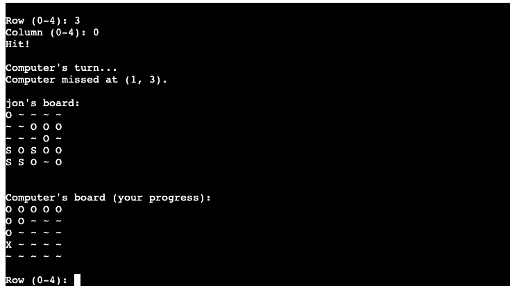
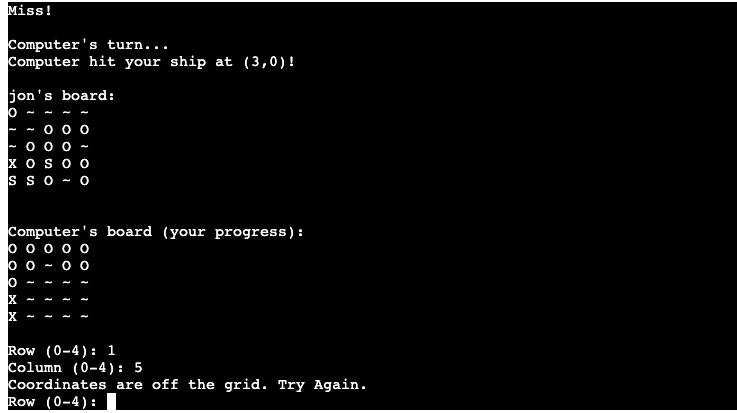
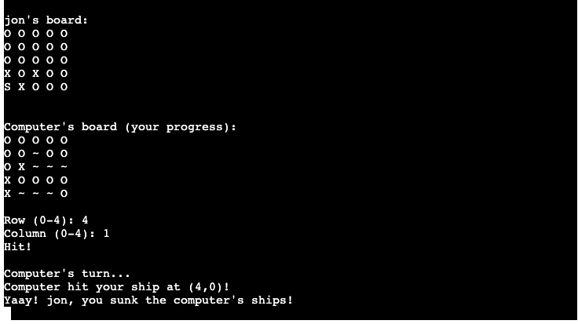
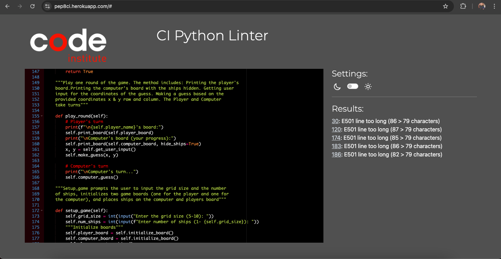
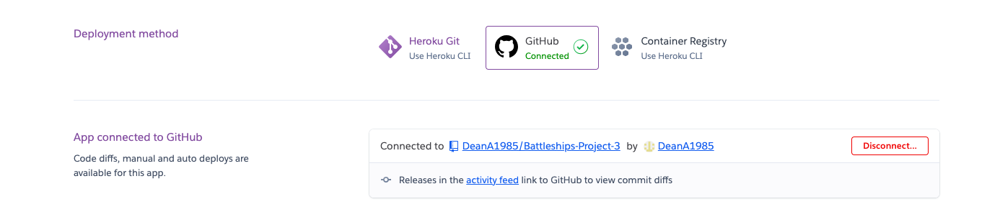
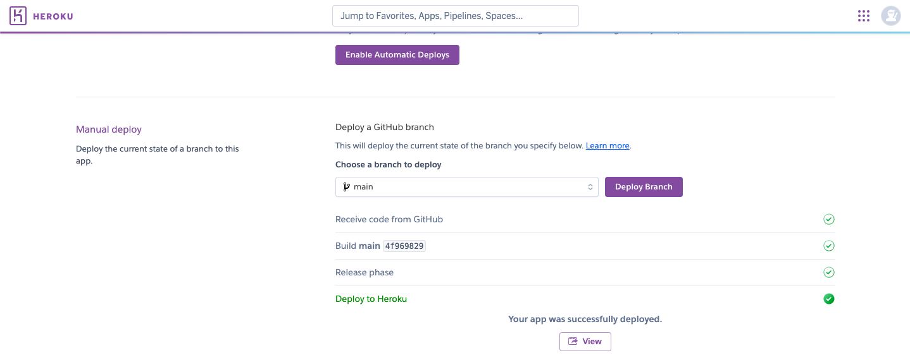

# Battleship Game

## Overview

This is a terminal-based Battleship game built using Python. The player plays against the computer, taking turns guessing the locations of the opponents ships. The player can customise the grid and the number of ships at the start of the game. The game continues until one player sinks all of the other player's ships. At the end of the game the player is congratulated that they have won or told that they have lost. 

 https://en.wikipedia.org/wiki/Battleship_(game)

[Please view the Heroku Terminal Here](https://battleships-pythonprojects3-e71c4d655ba3.herokuapp.com/)

## Features
- A Customisable grid size (between 5x5 and 10x10) The system uses input validation to regulate this.
- A customisable number of ships between 1 and the grid size.
- The player can input row and column guesses to try and hit the computer's ships.
- The computer randomly guesses the locations of the player's ships.
- Game progress is shown on the boards with hits marked as 'X' and misses marked as 'O'.
- The computer's ships are hidden from the player but their hits and misses are shown.

## System Requirements 
- To run the game you need to have Python3 installed on your system

## How to Play 

#### Setting Up
  - At the start of the game you will be asked to enter your name then you will be asked to set up your grid 5x5 or 10x10
   You will also be prompted for a number of ships to place on the grid(between 1 and the grid size) The game randomly places the ships for you.

#### Gameplay
  - The game will alternate turns between the player (you) and the computer.
  - On your turn, you will enter the row and column number using 0-based indexing so on a 10 X 10 grid the index is 0-9 on a 5 x 5 is 0 to 4, you are guessing where the computer has placed a ship.
  - The computer will also randomly guess the location of your ships.
  - The game will indicate whether the guess was a hit ('X') or a miss ('O') on the board.

#### Winning or Losing
  - The game ends when all the ships on either end have sunken and it gives a message letting you know if you have won or lost. The game is now considered to be over.

  ## Input Validation and Error Checking 
  
  ### Coordinates Outside the Player Grid
   - You can not enter coordinates outside of your playable grid
   - You can not guess the same co-ordinates twice
   - The number of ships can't exceed the grid size 

   
   
   

   ### Data Model
   My data model is a class named BattleshipGame it provides a foundational structure for the game The class is initialized with several attributes that are essential for managing the game state, including player information, board sizes, ship counts, and tracking hits and misses for both the player and the computer.

## Game Walkthrough

- Here is a walkthrough of the game experience using a 5 x 5 grid with 4 ships.

## Constraints

The deployment terminal is set to 80 columns by 24 rows. That means that each line of text needs to be 80 characters or less otherwise it will be wrapped onto a second line.

## Testing

I have manually tested my project through the gitpod terminal, Heroku and Replit terminal  and I have not encountered any errors. I have passed it through PEP8 and there are 5 lines of code which slightly exceed the 79 character limit boundary however they have no effect on the game functionality in the Heroku terminal. I have tried to shorten these lines however 
when I shorten them they have a major effect on running the python file as they become indented lines of code which do not need to be indented. 

## Bugs

I was experiencing a large amount of bugs when testing the project. The main issue I was facing was running my python file in heroku. I had to change my procfile settings and also add import os to the top of my code as well as creating a space after the main line at the bottom of my code which is where python reads first.

## Grid Size Exceeding Limit

- If the player enters a grid size or number of ships outside of the specified range the game was allowing invalid inouts or for example a 20 X 20 grid. I had to regulate this by declaring a function that specified a input range for grids and ships. See setup_game function in which there are specific parameters that a grid can be set to. Subsequently followed by a maximum amount of ships you can have according to the grid size. My current code includes validation for these inputs see setup_game but I had to ensure through walkthrough testing that every point where the player can enter a grid or number of ships includes proper checks and that the game handles these functions properly.

## Computer Board Not Displaying Accurate

- The computer's board should hide unhit ships and display hits and misses. But issues with my print_board function caused the display to not progress accurately. Fixing my print_board method helped me correct this.

## 0-based indexing 
- Although changing the game to 1 - based indexing would be more intuitive and provide a positive user friendly experience for the user I encounter bugs when trying to change my game model over to this, so I decided to remain with 0-based indexing.

# Deployment 

- The project was deployed using code institutes mock terminal for Heroku 

- Steps for Deployment 

1. Clone the Repository
2. Create a New Heroku App
3. Set the buildbacks to Python and Node JS in this exact order
4. Link the Heroku app to your github repository 
5. Click on Deploy
6. Then click View

# Credits

Code institute for the deployment terminal 
Wikipedia for referencing purposes
